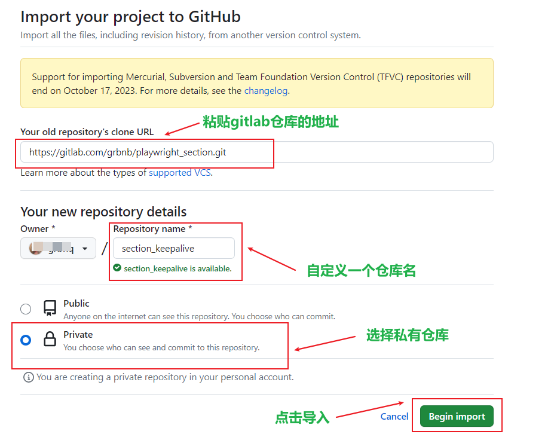
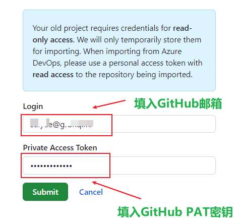
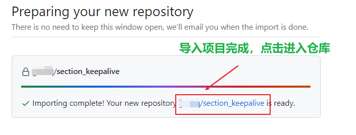
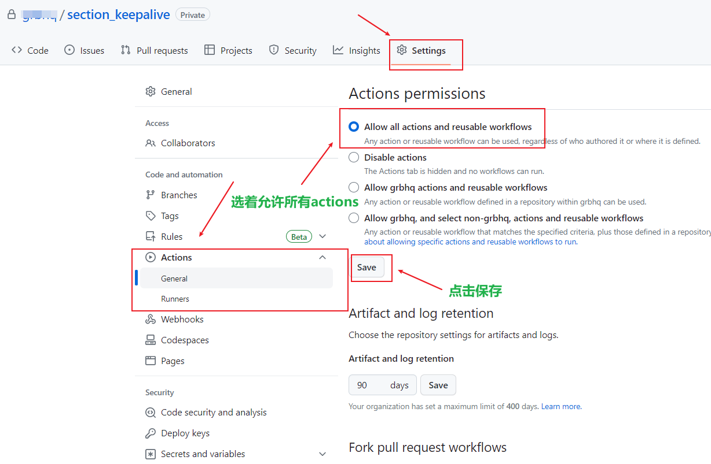
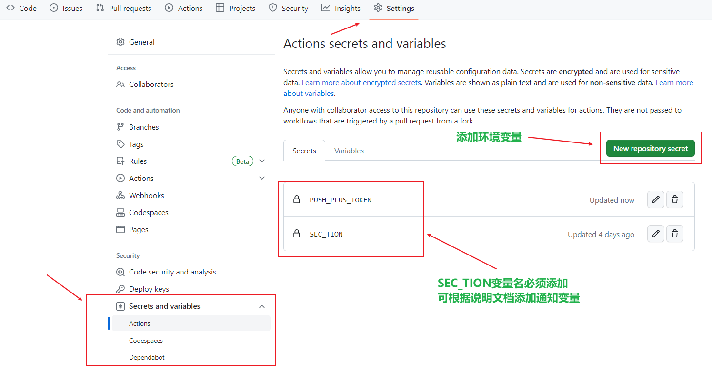
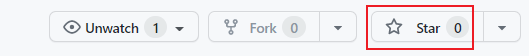
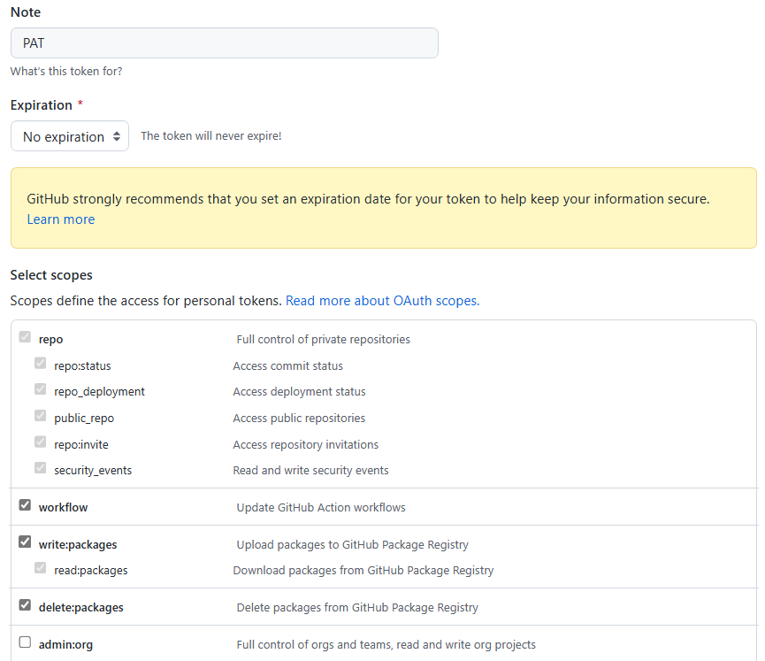

## Github actions使用教程

- > 确保你当前的gitlab账号已绑定GitHub账户，否则无法使用URL一键导入。需要手动下载上传文件到GitHub，此教程仅针对已绑定GitHub的用户！

1、进入你的GitHub账户，创建一个新仓库，或点击此处跳转[Github一键导入仓库](https://github.com/new/import)

2、导入私库需要填写你的GitHub邮箱和token密钥，请提前获取你的账户token密钥[ghp_xxxxxxxxx]。如果没有, 请前往创建[具体教程](#创建github的github_tokenpat密钥教程)

3、等待导入完成，进入仓库

4、开启仓库actions功能

5、根据变量详情表，添加对应的环境变量，非必须变量还需要在section.yml工作流文件中添加。

6、手动触发actions运行，点击仓库右上角Star变为Starred即可，下次如需要再触发请先取消Starred

##### 创建GitHub的GITHUB_TOKEN(PAT)密钥教程

点击查看

- 点击右侧图标(https://github.com/settings/tokens/new) ，设置token密钥

- 在`Note`处填入一个名称 -> 在`Expiration`处选择一个有效期 -> 在`Select scopes`处依次勾选`repo`、`workflow`、`write:packages`和`delete:packages` -> 点击最下方`Generate token`

- 只能显示一次，请复制保存好刚刚生成的GITHUB_TOKEN(PAT)密钥。

